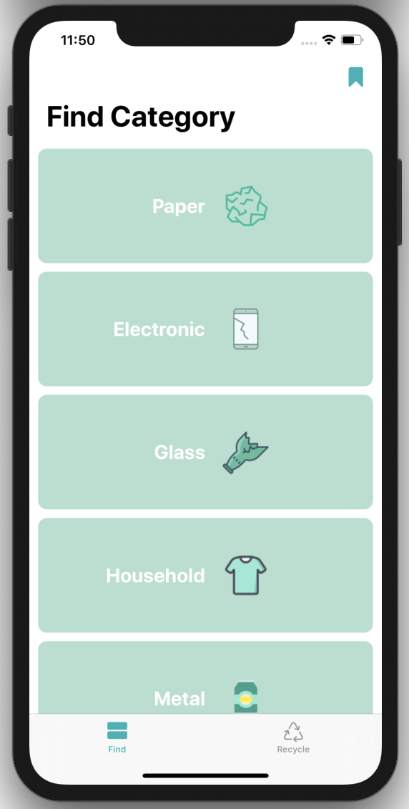
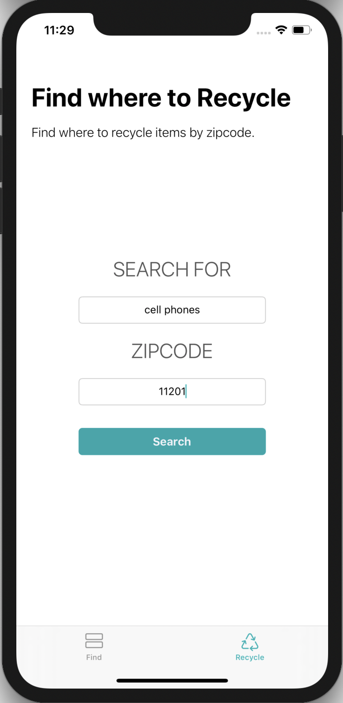

# RENEW

## About

Recycling has become an issue globally and the lack of knowlege on how to properly recycle may be the biggest barrier to being green in the United States. 

**Renew** is an app to ease the process of recycling, by providing users a recycle guide which includes information on how and where to recycle different items.
Renew allows users to search through a list of items in a selected category and find recycling preparation steps, information on why to recycle as well as more on the recycling process. Users can also find recycling locations by searching by item and zipcode, as well as get directions from their current location. 

## Screen Shots

 

## Technologies & Frameworks used
- Xcode 11, Swift 5, UIKit 
- MapKit 
- Firebase 
- Safari Services 
- [Kingfisher CocoaPods](https://cocoapods.org/pods/Kingfisher)
- [SwiftLint](https://github.com/realm/SwiftLint)

## Future Implementation
- Add a FAQ page
- Community: Provide users a way to interact for support, disscussion, etc.
- Provide access to latest news on recycling, to keep users informed
