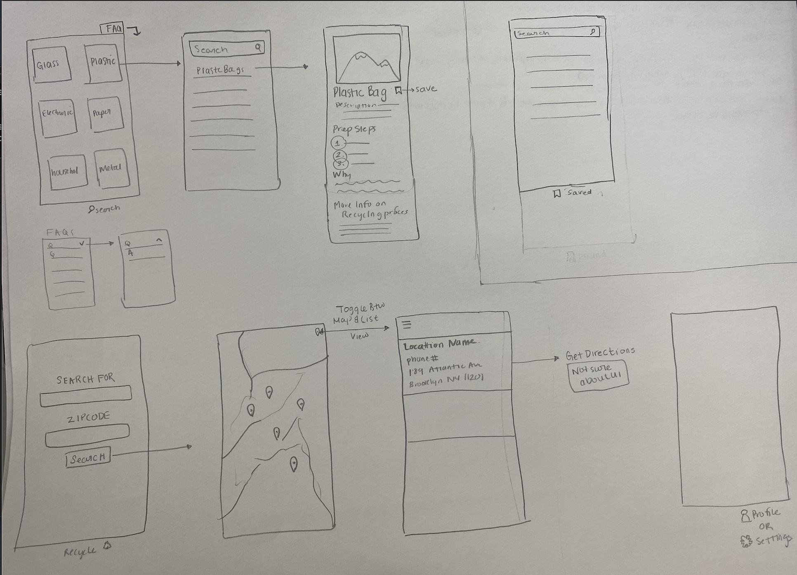

# Renew
An app to ease the process the recycling, providing users a recycle guide which includes information on how and where to recylce different items.

### User Stories 

- [x] User can select from a list of material categories 
- [x] User can search through a list of items in a selected category 
- [x] User can view recyling details 
- [x] Detail should display image, item name, description, recycling preperation steps (1, 2, 3), info on why we recycle, more info on recycling process 
- [ ] User can save items for easy access to its info later 
- [ ] User can find recycling locations by searching by item and zipcode
- [ ] User can view locations on map view 
- [ ] User can toggle to a list view of locations 
- [ ] User can select item and get directions (incorperate apple or google directions)
- [ ] User can view FAQs 

### Wireframe 

#### UX Inspirition (but not UI): 
[Earth 911](https://earth911.com/), [How to Recyle](https://earth911.com/recycling-center-search-guides/?utm_source=earth911-header&utm_medium=top-navigation-menu&utm_campaign=top-nav-recycle-guide-button), [Where to Recyle](https://search.earth911.com/?utm_source=earth911-header&utm_medium=top-navigation-menu&utm_campaign=top-nav-recycle-search-button)

#### Next Steps 
- [x] Step up firebase 
- A collection of mterial categories [Glass, Plastic, Electronic, Paper, Household, Metal].
- A collection of recylable items. Fields: [imageURL: String, materialID: String, name: String, description: String, prepSteps: [String], whyRecycle: String, recyclingProcess: [String]

- [x] Set up UI 
- 3 tabs: Find, Saved, Recycle

#### Resources I want to look at later 
- [Search Controller](https://developer.apple.com/documentation/uikit/view_controllers/displaying_searchable_content_by_using_a_search_controller)
- [Searching for near by points of interests](https://developer.apple.com/documentation/mapkit/searching_for_nearby_points_of_interest)

