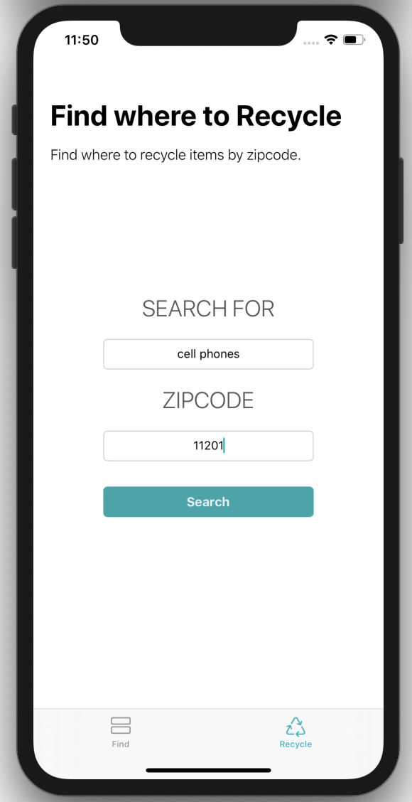

# Renew

## About
**Renew** is an app to ease the process the recycling, providing users a recycle guide which includes information on how and where to recycle different items.
Renew allows users to search through a list of items in a selected category and find recycling preparation steps, info on why to recycle as well as more info on the recycling process. Users can find recycling locations by searching by item and zipcode, as well as get directions from their current location. 

## Screenshots
 

## Technologies & Frameworks used
- Xcode 11, Swift 5, UIKit 
- MapKit 
- Firebase 
- Safari Services 
- [Kingfisher CocoaPods](https://cocoapods.org/pods/Kingfisher)

## Future Implementation
- Community: Provide users a way to interact for support, disscussion, etc.
- Add a FAQ page

#### UX Inspirition (but not UI): 
[Earth 911](https://earth911.com/), [How to Recyle](https://earth911.com/recycling-center-search-guides/?utm_source=earth911-header&utm_medium=top-navigation-menu&utm_campaign=top-nav-recycle-guide-button), [Where to Recyle](https://search.earth911.com/?utm_source=earth911-header&utm_medium=top-navigation-menu&utm_campaign=top-nav-recycle-search-button)
